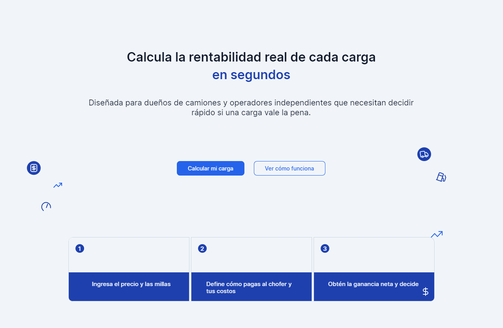
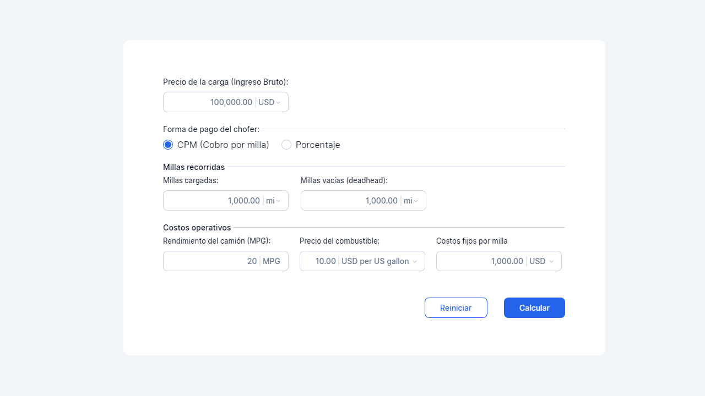
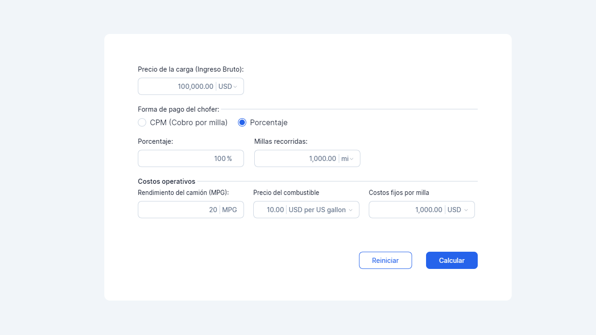
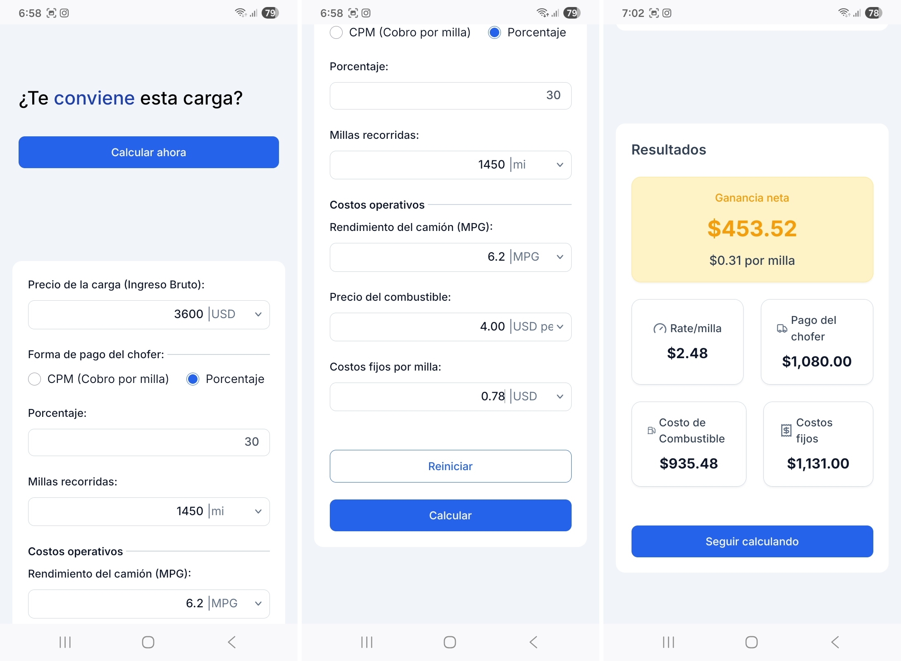
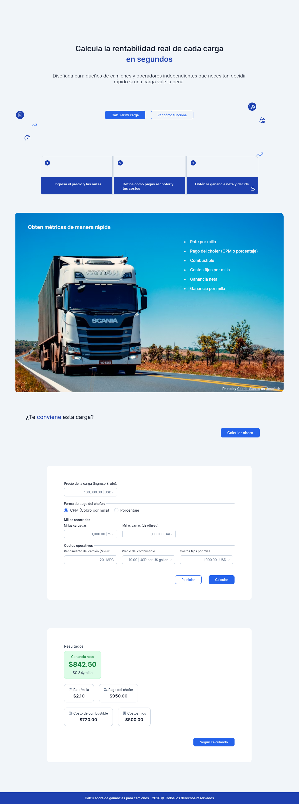

# Calculadora-ganancias-camiones

A web application designed to help truck owners and independent operators quickly evaluate the profitability of each load before accepting it. The tool provides a simple interface to input key details such as load price, miles traveled, driver payment method, and main operating costs. Based on this data, it calculates:

- Rate per mile  
- Driver payment  
- Total operating costs  
- Net profit (total and per mile)  

This ensures that decisions are made with clarity and precision, helping operators maximize efficiency and profitability.

## ✨ Features

- Input load price and mileage  
- Flexible driver payment options  
- Operating cost breakdown  
- Automatic calculation of rate per mile  
- Clear display of net profit (total and per mile)  
- Easy‑to‑use interface for quick evaluations
- Responsive design 
  
## 🛠️ Tech Stack

- React | TailwindCSS | Nextjs
  
## 🚀 Getting Started

### Installation
```bash
#Clone the repository
git clone https://github.com/Alvarez-Bermudez/Calculadora-ganancias-camiones.git

#Navigate to project folder
cd Calculadora-ganancias-camiones

#Install dependencies
pnpm install
```

### Running the App
```bash
pnpm dev
```

## 🤝 Contributing

Contributions are welcome! Please fork the repository and submit a pull request with your improvements.

## Design
Open the folder "design-Lunacy". It contains the design file. Open it with Lunacy app

## 📸 Screenshots





